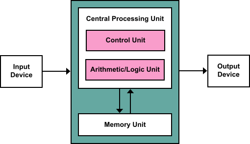
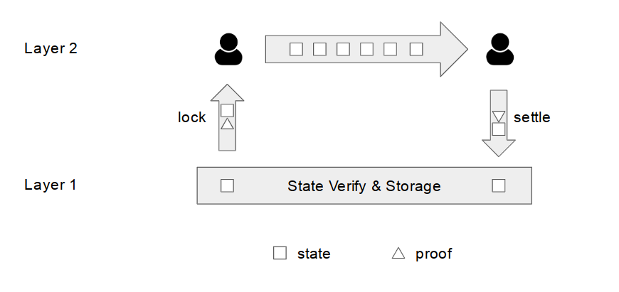
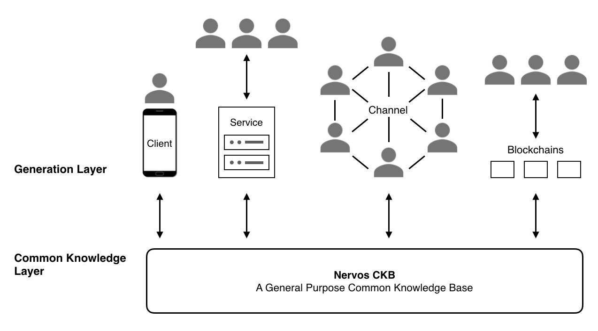

## Nervos Approach

Nervos Network的技术目标是设计一个[分层的加密经济网络 ](https://talk.nervos.org/t/topic/336)。这样一个出发点带来的是一个与众不同的设计思路，我们自己把它称为[Nervos Approach]:

**如果我们认为分层是未来的发展方向，我们应该从一开始就考虑到上层协议和分层网络的需求，在分层的大框架下去设计区块链协议。**

<!--truncate-->

换句话说，从分层的角度来看，现有的区块链设计方式都是过时的。现有的区块链在设计时考虑的是特定的功能（例如支付，或者是运行DApp），并希望在运行一段时间后让上层协议来适应自己。然而如果我们阅读互联网的历史就知道，今天互联网的协议分层不是这样打补丁打出来的，相反是在吸收过去经验之后[基于分层的思路重新设计出来的 ](https://en.wikipedia.org/wiki/Internet_protocol_suite)（是的，互联网协议也是分层的，这是我们为什么总是说 TCP/IP，它们实际上是两个协议的名字）。Nervos Approach是向互联网学习的产物。

这是为什么区块链并不天然是Layer 1，Layer 1是需要设计的。这也是为什么我们选择设计CKB这样一个新的区块链协议。

## Layer 1 vs. Layer 2

要弄清Layer 1应该做什么，先要弄清楚它和上层协议的区别。Layer 2起源与我们发现公有链（这里指permissionless blockchain）的性能不足，很难扩容到满足整个加密经济体需求的水平，同时我们又非常迷恋公有链提供的可用性和极大的服务范围，因此慢慢演化出了一系列可以由区块链来保证安全的Layer 2协议，例如支付通道(payment channel), plasma, etc.

这些协议的共同特点是牺牲共识范围来换取性能。公有链最让人惊艳的地方是通过开放网络提供不间断的覆盖全球的服务，这意味着全球共识，也意味着性能底下。解决这个问题的最好方式是将大部分交易转移到共识范围更小但是性能更好的上层协议中，并且保证上层协议的参与者总是可以[在不满意的时候退回到区块链上来解决问题 ](https://en.wikipedia.org/wiki/Exit,_Voice,_and_Loyalty)，代价仅仅是一些时间成本。

因此作为Layer 1的区块链，关注点显然不应该是性能，因为Layer 2会承担这个职责。Layer 1是保障上层协议参与者的最后防线，它的关注点应该是安全和去中心化（安全和去中心化是两个东西，有时间再展开）。如果我们观察Layer 2协议与Layer 1交互的模式，我们还会发现，Layer 1负责的是状态共识（存储），Layer 2负责的是状态生成（计算）。

## 计算与状态

程序员的世界中有一个流传甚广的公式：[程序 = 算法 + 数据结构 ](https://en.wikipedia.org/wiki/Algorithms_%2B_Data_Structures_%3D_Programs)。这个等式指出了程序设计的两个核心关注点，计算（算法即计算的步骤）与数据（计算的对象）。而数据又可以分为两种，程序输入（外部数据）和状态（内部数据）。

计算机科学中的”状态“一词可以理解为程序在运行时某个特定时刻可访问的一切数据。程序中有变量，变量通常代表着内存中的一个可以存放数据的位置，这个位置的内容就是程序的状态。一段程序的输出完全取决于它的输入和其开始执行时的状态。计算（CPU）、输入/输出（IO）与状态（内存）构成了完整的[冯诺依曼体系 ](https://en.wikipedia.org/wiki/Von_Neumann_architecture)，今天最流行的计算架构。

## 以支付通道为例

在支付通道中，Layer 2的共识范围缩小到两人之间，这是最小范围的共识。参与通道的两人进行的操作如下：

1. 向Layer 1发送交易建立通道，锁定特定的状态，锁定的状态只有用Alice和Bob双方的签名才能更新
  1. 例如Alice锁定1 BTC，Bob锁定1 BTC，我们用(1, 1)表示在Layer 1锁定的状态
2. 双方通过链外的网络连接(Layer 2)，产生并交换新的状态，各自签名
  1. Alice → Bob 0.5 BTC，Alice/Bob在本地保存的新状态为(0.5, 1.5)
  2. Bob → Alice 0.1 BTC, Alice/Bob在本地保存的新状态为(0.6, 1.4)
  3. …
  4. 最后一次交换后，Alice/Bob在本地保存的新状态为(0.2, 1.8)，而且双方都对该状态进行了签名
3. 向Layer 1发送最终的状态，Layer 1验证最终提交的状态有Alice/Bob双方的签名，更新锁定的状态为(0.2, 1.8)并解锁

从这个例子我们很容易看到，在整个过程中，我们通常讨论的计算分成了两个部分进行：新状态的生成，新状态的验证。前者发生在Layer 2，而后者发生在Layer 1。如果我们观察其他的Layer 2协议，例如Plasma或者是TrueBit，很容易得到类似的结论。正因为Layer 1会验证Layer 2产生的状态，我们才能够做到通过Layer 1保证Layer 2的安全，因为Layer 2的用户在遇到问题的时候，总是可以请求Layer 1来做某种形式的验证（这是为什么Layer 1可以看作”Crypto Court”，因为它是一个能识别密码学证明的“法院”）。

因此在分层架构下，Layer 1的关注点应该是状态的验证（和存储），Layer 2的关注点应该是状态的生成。通过将状态的生成转移到Layer 2，将生成和验证分离，我们的分层网络兼顾了性能（Layer 2）、安全和去中心化（Layer 1）。

任何程序都有计算和状态，区块链上运行的程序（DApp）自然也不例外，在分层架构上构建应用时，需要考虑在哪里产生状态，在哪里验证状态，在哪里保存状态。由于状态的生成和验证分离，状态生成的方法可以和验证解耦，状态生成不必被Layer 1的编程模型绑定，具有更大的自由度。只要能通过Layer 1验证，状态的生成甚至可以是中心化的（事实上大部分Plasma协议中只有一个Operator!）。

## Layer 1应该做什么

我们在说“计算”的时候，实际上说的是“状态生成”。在一般的计算模型里面，不存在信任和安全问题（我的CPU不会用假的结果骗我），所以生成就好，不考虑验证；但是在区块链网络里面，我们不仅需要生成，还需要验证。Layer 1的关注点应该是状态的验证和存储，而不是状态生成（希望你没有被绕晕…）。

由此我们终于可以推出Layer 1应该做什么：

- 1、**需要一个安全的共识协议，范围越大越好。** 基于PoW的Nakamoto Consensus正是这样一个协议，这是唯一一个在现实环境中经过验证的全球共识。
- 2、**需要可编程能力，以支持各种状态验证逻辑，这意味着我们需要一个强大的编程模型（状态模型+虚拟机）。**
- 3、**需要能够理解各种密码学证明，因为区块链协议是基于密码学构建的，Layer 1与Layer 2之间传递的证明是密码学证明。**
- 4、**需要管理好状态，因为经过验证的状态会留在Layer 1上。** 这意味着我们需要一个[关注状态的经济模型 ](https://github.com/nervosnetwork/rfcs/pull/78)。

---
🔗👉[查看原文](https://talk.nervos.org/t/layer-1/1486)，获得更多精彩留言。